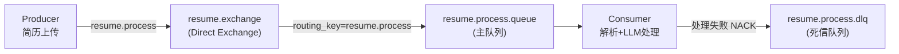
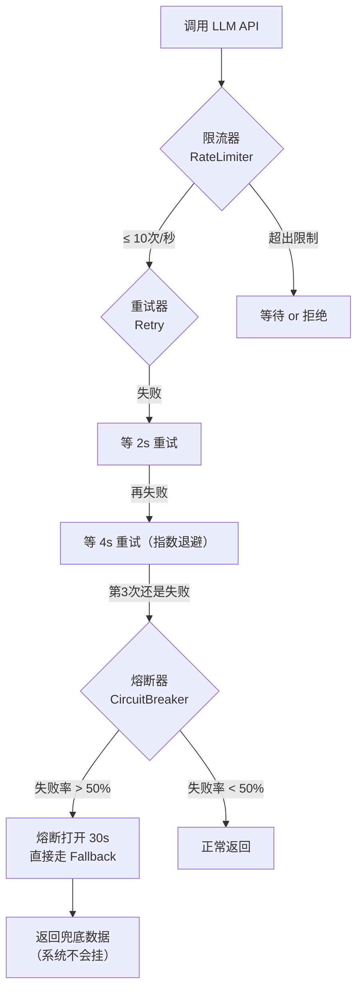
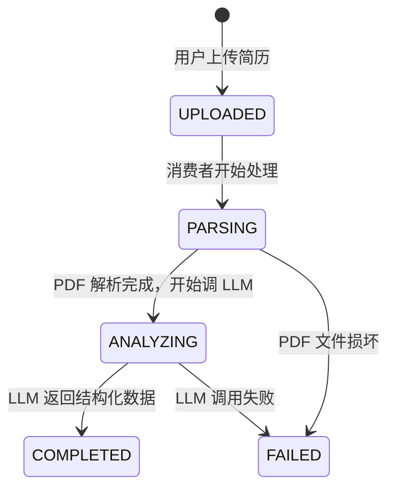

# AI 简历匹配系统 — 技术升级说明文档

## 一、项目概述

这是一个 **AI 驱动的简历-职位匹配系统**，用户上传 PDF 简历后，系统通过 LLM（大语言模型）提取结构化信息，然后智能匹配合适的职位。

**本次升级的核心目标**：把原来"只是摆在那里好看"的中间件（MySQL、RabbitMQ、Elasticsearch）全部真正用起来，同时加入生产级的容错、缓存、流式传输等深度技术。

---

## 二、升级前 vs 升级后 — 一张图看懂

### 升级前的数据流

```
用户上传简历
    ↓
Controller 接收文件
    ↓
保存到 H2 内存数据库（重启数据就没了）
    ↓
用 Spring Event 假装是消息队列（其实还是同一个进程里调用）
    ↓
调 LLM API（没有重试、没有熔断、挂了就挂了）
    ↓
500个职位全部加载到内存，for 循环一个个比对
    ↓
返回结果
```

> [!WARNING]
> 问题：docker-compose 里配了 MySQL / RabbitMQ / Elasticsearch，但代码里一个都没真正使用。

### 升级后的数据流

```
用户上传简历
    ↓
Controller 接收文件 → 保存到 MySQL（持久化，重启不丢数据）
    ↓
发消息到 RabbitMQ 队列（真正的异步解耦）
    ↓
消费者从队列取消息 → 解析 PDF → 调 LLM API
    ↓                                ↑
    ↓                     有熔断器保护、自动重试、限流
    ↓
结构化数据存 MySQL，处理状态实时更新
    ↓
前端轮询状态接口，看到每一步进度
    ↓
职位匹配走 Elasticsearch（倒排索引，毫秒级搜索）
    ↓
AI 分析结果先查 Redis 缓存（命中则直接返回）
    ↓
未命中则调 LLM，结果缓存到 Redis（24小时有效）
    ↓
通过 SSE 流式推送给前端（逐字显示，打字机效果）
```

---

## 三、每个改动的详细说明

### 3.1 MySQL 替换 H2 — 数据不再是一次性的

**改了什么**：

| 文件 | 改动 |
|------|------|
| [application.properties](file:///d:/project/src/main/resources/application.properties) | 数据源从 `jdbc:h2:mem` 改为 `jdbc:mysql://localhost:3306/resume_db` |
| [pom.xml](file:///d:/project/pom.xml) | 添加 `mysql-connector-j` 依赖，H2 改为 `test` scope |

**为什么这么改**：
- H2 是内存数据库，应用重启所有数据都丢失
- MySQL 是持久化数据库，数据存在磁盘上，重启不丢
- 同时配置了 HikariCP 连接池参数（最大连接数、空闲超时等），这是生产环境标配

**你可以说的技术点**：MySQL 持久化存储 + HikariCP 连接池调优

---

### 3.2 RabbitMQ 真正的消息队列 — 不再是假的

**改了什么**：

| 文件 | 操作 | 说明 |
|------|------|------|
| [RabbitMQConfig.java](file:///d:/project/src/main/java/com/example/hello/config/RabbitMQConfig.java) | 🆕 新建 | 定义了消息队列的完整拓扑结构 |
| [RabbitMQProducer.java](file:///d:/project/src/main/java/com/example/hello/service/RabbitMQProducer.java) | ✏️ 重写 | 从 Spring Event 改为真正的 RabbitTemplate |
| [ResumeProcessingConsumer.java](file:///d:/project/src/main/java/com/example/hello/service/ResumeProcessingConsumer.java) | ✏️ 重写 | 从 @EventListener 改为 @RabbitListener |
| [ResumeProcessMessage.java](file:///d:/project/src/main/java/com/example/hello/dto/ResumeProcessMessage.java) | 🆕 新建 | 消息传输对象，用 JSON 序列化 |

**之前的问题**：

```java
// 之前的 RabbitMQProducer.java —— 名字叫 RabbitMQ，但实际用的是 Spring Event
@Service
public class RabbitMQProducer {
    @Autowired
    private ApplicationEventPublisher eventPublisher;  // ← 跟 RabbitMQ 没有任何关系！
}
```

**现在怎么做的**：

```java
// 现在的 RabbitMQProducer.java —— 真正通过 RabbitMQ 发送消息
@Service
public class RabbitMQProducer {
    private final RabbitTemplate rabbitTemplate;  // ← 真正的 RabbitMQ 客户端

    public void sendResumeUploadMessage(String resumeId, String filePath) {
        rabbitTemplate.convertAndSend(EXCHANGE_NAME, ROUTING_KEY, message);  // ← 消息发到 RabbitMQ
    }
}
```

**消息队列拓扑**：



**关键设计**：
- **手动 ACK**：消息处理成功后才从队列移除，不会丢消息
- **NACK + DLQ**：处理失败的消息不会丢弃，会转入死信队列（Dead Letter Queue），可以后续排查和重试
- **Publisher Confirm**：发送方确认机制，确保消息到达了 Exchange

**你可以说的技术点**：消息队列异步解耦、手动 ACK 保证可靠性、DLQ 兜底失败消息

---

### 3.3 Elasticsearch 搜索引擎 — 不再是 for 循环

**改了什么**：

| 文件 | 操作 | 说明 |
|------|------|------|
| [JobPositionDoc.java](file:///d:/project/src/main/java/com/example/hello/es/JobPositionDoc.java) | 🆕 新建 | Elasticsearch 文档类（搜索用的数据模型） |
| [JobPositionEsRepository.java](file:///d:/project/src/main/java/com/example/hello/es/JobPositionEsRepository.java) | 🆕 新建 | Elasticsearch Repository |
| [JobMatchingService.java](file:///d:/project/src/main/java/com/example/hello/service/JobMatchingService.java) | ✏️ 重写 | 匹配逻辑从内存扫描改为 ES 查询 |
| [JobInitializerService.java](file:///d:/project/src/main/java/com/example/hello/service/JobInitializerService.java) | ✏️ 重写 | 启动时把 MySQL 数据同步到 ES |

**之前的问题**：

```java
// 之前 —— 把 500 个职位全部加载到内存，然后 for 循环一个个比
Iterable<JobPosition> allJobs = jobPositionRepository.findAll();  // 全量加载！
for (JobPosition job : allJobs) {       // O(N) 逐一对比
    if (!isEducationMatch(...)) continue;
    // ...
}
```

**现在怎么做的**：

```java
// 现在 —— 用 Elasticsearch 的 Bool Query，数据库引擎帮你做过滤和打分
BoolQuery.Builder boolBuilder = new BoolQuery.Builder();

// 硬性过滤（filter）：学历必须符合、毕业时间必须符合
boolBuilder.filter(f -> f.terms(t -> t.field("educationRequirement")...));

// 软性打分（should）：技能越匹配，分数越高
for (String skill : userSkills) {
    boolBuilder.should(s -> s.term(t -> t.field("skillsRequirement").value(skill).boost(2.0f)));
}
// Elasticsearch 自动按相关性分数排序返回
```

**架构模式 — CQRS（命令查询职责分离）**：

```
写操作 → MySQL（权威数据源）
读操作 → Elasticsearch（搜索引擎）
启动时  → MySQL 全量同步到 ES
```

这样 MySQL 负责数据的正确性，ES 负责搜索的速度。两者各司其职。

**你可以说的技术点**：CQRS 架构模式、Elasticsearch Bool Query + BM25 相关性打分、倒排索引

---

### 3.4 Redis 缓存 — LLM 结果不再每次都重新调

**改了什么**：

| 文件 | 操作 | 说明 |
|------|------|------|
| [RedisConfig.java](file:///d:/project/src/main/java/com/example/hello/config/RedisConfig.java) | 🆕 新建 | Redis 缓存配置，不同数据不同过期时间 |
| [LLMService.java](file:///d:/project/src/main/java/com/example/hello/service/LLMService.java) | ✏️ 重写 | 分析结果存入 Redis，下次直接从缓存读 |
| [docker-compose.yml](file:///d:/project/docker-compose.yml) | ✏️ 修改 | 添加 Redis 7 服务 |

**缓存策略**：

```
用户点击"AI 分析职位"
    ↓
先查 Redis：key = "llm:analysis:{jobId}"
    ↓
  命中 → 直接返回（0ms，不调 LLM）
  未命中 → 调 LLM API → 结果存入 Redis（TTL = 24小时）→ 返回
```

**多级缓存配置**：

| 缓存区域 | 过期时间 | 用途 |
|----------|----------|------|
| `llm:analysis` | 24 小时 | LLM 分析结果（调用成本高，缓存久一点） |
| `jobs:list` | 5 分钟 | 职位列表（数据可能更新，缓存短一点） |
| `default` | 1 小时 | 其他数据 |

**你可以说的技术点**：Redis Cache-Aside 模式、多级 TTL 缓存策略

---

### 3.5 Resilience4j — LLM 调用的生产级保护

**改了什么**：

| 文件 | 改动 |
|------|------|
| [LLMService.java](file:///d:/project/src/main/java/com/example/hello/service/LLMService.java) | 加了三个注解：@CircuitBreaker、@Retry、@RateLimiter |
| [application.properties](file:///d:/project/src/main/resources/application.properties) | 配置了熔断/重试/限流的参数 |

**三层保护机制**：



**具体参数**：
- **熔断器**：最近 10 次调用中失败超过 50% → 熔断 30 秒 → 期间所有请求直接走 fallback
- **重试**：失败后 2s → 4s → 8s 重试（指数退避），最多 3 次
- **限流**：每秒最多 10 次调用，防止打爆 LLM API

**之前的问题**：LLM API 挂了 → 用户一直等 → 超时 → 报错。没有任何保护。

**现在**：LLM API 挂了 → 自动重试 3 次 → 都失败就熔断 → 返回兜底数据 → 用户不受影响。

**你可以说的技术点**：微服务容错三件套（Circuit Breaker / Retry / Rate Limiter）、优雅降级

---

### 3.6 SSE 流式输出 — AI 分析像 ChatGPT 一样逐字显示

**改了什么**：

| 文件 | 操作 | 说明 |
|------|------|------|
| [JobController.java](file:///d:/project/src/main/java/com/example/hello/controller/JobController.java) | ✏️ 重写 | 新增 `/api/jobs/analyze/stream` SSE 端点 |
| [index.html](file:///d:/project/src/main/resources/static/index.html) | ✏️ 修改 | 前端用 EventSource 接收流式数据 |

**工作原理**：

```
后端（SseEmitter）                          前端（EventSource）
    ↓                                            ↓
获取完整分析文本                          new EventSource('/api/jobs/analyze/stream?jobId=123')
    ↓                                            ↓
每 30ms 发送 3 个字符  ─── event: chunk ───→  收到 chunk，追加到页面
每 30ms 发送 3 个字符  ─── event: chunk ───→  收到 chunk，追加到页面
每 30ms 发送 3 个字符  ─── event: chunk ───→  收到 chunk，追加到页面
...                                            ...
发送完毕             ─── event: done ────→  关闭连接
```

如果 SSE 连接失败，前端会自动降级为普通 POST 请求（一次性返回完整结果）。

**你可以说的技术点**：Server-Sent Events 协议、流式传输、优雅降级

---

### 3.7 异步任务状态机 — 处理进度实时可见

**改了什么**：

| 文件 | 操作 | 说明 |
|------|------|------|
| [ResumeMetadata.java](file:///d:/project/src/main/java/com/example/hello/entity/ResumeMetadata.java) | ✏️ 修改 | 新增 `status` 字段 |
| [ResumeController.java](file:///d:/project/src/main/java/com/example/hello/controller/ResumeController.java) | ✏️ 重写 | 新增 `GET /api/resume/{id}/status` 接口 |
| [ResumeProcessingConsumer.java](file:///d:/project/src/main/java/com/example/hello/service/ResumeProcessingConsumer.java) | ✏️ 重写 | 每个处理步骤更新状态 |

**状态机流转**：



**之前**：用户上传简历后，前端 `setTimeout(refreshJobs, 2000)` 盲猜等 2 秒——万一处理时间超过 2 秒就看不到结果。

**现在**：前端每 1.5 秒轮询 `/api/resume/{id}/status`，页面上显示实时进度：
- 📤 已上传，等待处理...
- 📄 正在解析 PDF...
- 🤖 AI 正在分析简历...
- ✅ 分析完成！正在匹配职位...

**你可以说的技术点**：有限状态机（FSM）、异步任务可观测性

---

### 3.8 工程化改进 — 代码质量提升

#### 统一 API 响应格式

| 文件 | 操作 |
|------|------|
| [ApiResponse.java](file:///d:/project/src/main/java/com/example/hello/dto/ApiResponse.java) | 🆕 新建 |
| [GlobalExceptionHandler.java](file:///d:/project/src/main/java/com/example/hello/exception/GlobalExceptionHandler.java) | 🆕 新建 |
| [BusinessException.java](file:///d:/project/src/main/java/com/example/hello/exception/BusinessException.java) | 🆕 新建 |

**之前**：每个接口返回格式不一样，有的返 Map，有的返 String，出错了有的返 body 有的返 status code。

**现在**：所有接口统一返回格式：
```json
{
    "code": 200,
    "message": "success",
    "data": { ... },
    "timestamp": "2026-04-26T01:00:00"
}
```

所有异常都被 `GlobalExceptionHandler` 拦截，统一格式返回，不会再有未处理的 500 错误。

#### 密码安全

| 文件 | 改动 |
|------|------|
| [UserService.java](file:///d:/project/src/main/java/com/example/hello/service/UserService.java) | 明文密码 → BCrypt 加密 |
| [SecurityConfig.java](file:///d:/project/src/main/java/com/example/hello/config/SecurityConfig.java) | 新增 BCryptPasswordEncoder Bean |

**之前**：`new User(username, password)` 密码直接明文存数据库，登录用 `equals()` 比较。

**现在**：`new User(username, passwordEncoder.encode(password))` 密码用 BCrypt 哈希后存储，登录用 `passwordEncoder.matches()` 比较。

#### 日志规范化

**之前**：`System.out.println("xxx")`（不规范，无级别、无时间戳）

**现在**：`log.info("Resume uploaded: resumeId={}, elapsed={}ms", id, time)`（SLF4J，有级别、有时间戳、有参数化）

#### 可观测性

添加了 Spring Boot Actuator，暴露以下端点：
- `/actuator/health` — 应用健康状态（含 MySQL、Redis、RabbitMQ、ES 连通性）
- `/actuator/metrics` — JVM 指标、HTTP 请求指标
- `/actuator/circuitbreakers` — 熔断器状态（CLOSED / OPEN / HALF_OPEN）

---

## 四、新增文件清单

| 文件 | 用途 |
|------|------|
| `config/RabbitMQConfig.java` | RabbitMQ 拓扑定义（Exchange + Queue + DLQ） |
| `config/RedisConfig.java` | Redis 缓存管理器 + 多级 TTL |
| `dto/ApiResponse.java` | 统一 API 响应包装类 |
| `dto/ResumeProcessMessage.java` | RabbitMQ 消息体 DTO |
| `es/JobPositionDoc.java` | Elasticsearch 文档模型（CQRS 读模型） |
| `es/JobPositionEsRepository.java` | Elasticsearch Repository |
| `exception/BusinessException.java` | 自定义业务异常 |
| `exception/GlobalExceptionHandler.java` | 全局异常处理器 |

## 五、修改文件清单

| 文件 | 核心改动 |
|------|----------|
| `pom.xml` | +8 个新依赖 |
| `application.properties` | 全部重写，配置所有中间件 |
| `docker-compose.yml` | +Redis 服务 |
| `HelloApplication.java` | +注解，分离 JPA/ES 扫描 |
| `RabbitMQProducer.java` | Spring Event → RabbitTemplate |
| `ResumeProcessingConsumer.java` | @EventListener → @RabbitListener + ACK + 状态机 |
| `LLMService.java` | +Resilience4j + Redis 缓存 + ObjectMapper |
| `JobMatchingService.java` | for 循环 → ES Bool Query |
| `JobInitializerService.java` | +MySQL→ES 同步 |
| `JobController.java` | +SSE 流式端点 |
| `ResumeController.java` | +状态查询接口 + ApiResponse |
| `ResumeMetadata.java` | +status 字段 |
| `ResumeMetadataRepository.java` | +findByResumeId |
| `UserService.java` | 明文 → BCrypt |
| `SecurityConfig.java` | +PasswordEncoder + Actuator 放行 |
| `AuthController.java` | +ApiResponse + 构造器注入 |
| `index.html` | +SSE 接收 + 状态轮询 |

---

## 六、运行方式

```bash
# 1. 启动所有中间件（MySQL + RabbitMQ + Elasticsearch + Redis）
docker-compose up -d

# 2. 等待所有服务启动完成（约 30-60 秒）
docker-compose ps   # 确认所有服务状态为 healthy

# 3. 启动 Spring Boot 应用
./mvnw spring-boot:run
# 或者
bash entrypoint.sh

# 4. 访问应用
# http://localhost:8080
```

应用启动后会自动：
1. 连接 MySQL，自动建表
2. 生成 500 条 mock 职位数据写入 MySQL
3. 把所有职位数据同步到 Elasticsearch 索引
4. 开始监听 RabbitMQ 队列，准备处理简历
